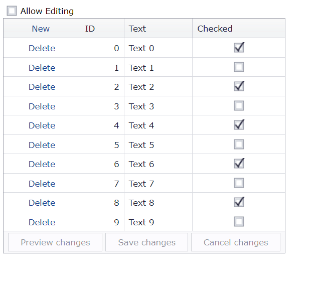

<!-- default badges list -->

[](https://supportcenter.devexpress.com/ticket/details/T150965)
[](https://docs.devexpress.com/GeneralInformation/403183)
<!-- default badges end -->
# GridView for ASP.NET MVC - How to enable or disable the cell edit functionality in batch mode based on a condition
<!-- run online -->
**[[Run Online]](https://codecentral.devexpress.com/128549835/)**
<!-- run online end -->

This example demonstrates how to use the check box state to enable or disable the grid's cell edit functionality in batch edit mode.



## Overview

Follow the steps below:

1. Create the [Grid View](https://docs.devexpress.com/AspNetMvc/DevExpress.Web.Mvc.GridViewExtension) control and populate it with columns. Set the grid's [SettingsEditing.Mode](https://docs.devexpress.devx/AspNet/DevExpress.Web.ASPxGridViewEditingSettings.Mode) property to `Batch` to enable the batch edit mode. Add a command column and set its [ShowNewButtonInHeader](https://docs.devexpress.devx/AspNet/DevExpress.Web.GridViewCommandColumn.ShowNewButtonInHeader) and [ShowDeleteButton](https://docs.devexpress.devx/AspNet/DevExpress.Web.GridViewCommandColumn.ShowDeleteButton) properties to `true`.

    ```cshtml
    @Html.DevExpress().GridView(settings => {
        // ...
        settings.SettingsEditing.Mode = GridViewEditingMode.Batch;
        settings.CommandColumn.Visible = true;
        settings.CommandColumn.ShowNewButtonInHeader = true;
        settings.CommandColumn.ShowDeleteButton = true;
        // ...
    }).Bind(Model).GetHtml()
    ```

2. Add a check box and handle its client-side [CheckedChanged](https://docs.devexpress.devx/AspNet/DevExpress.Web.ASPxCheckBox.CheckedChanged) event. In the handler, get the current state of the check box and assign the state to a flag variable.

    ```cshtml
    @Html.DevExpress().CheckBox(settings => {
        settings.Name = "AllowEditCB";
        settings.Text = "Allow Editing";
        settings.Properties.ClientSideEvents.CheckedChanged = "OnAllowEditChanged";
    }).GetHtml()
    ```

    ```js
    var allowEdit = false;
    function OnAllowEditChanged(s, e) {
        allowEdit = s.GetValue();
    }
    ```

3. Handle the grid's client-side [BatchEditStartEditing](https://docs.devexpress.devx/AspNet/js-ASPxClientGridView.BatchEditStartEditing), [BatchEditRowInserting](https://docs.devexpress.devx/AspNet/js-ASPxClientGridView.BatchEditRowInserting), and [BatcshEditRowDeleting](https://docs.devexpress.devx/AspNet/js-ASPxClientGridView.BatchEditRowDeleting) events. In the handler, cancel the current edit operation based on the flag variable value.

    ```cshtml
    @Html.DevExpress().GridView(settings => {
        // ...
        settings.ClientSideEvents.BatchEditRowDeleting = "OnEditing";
        settings.ClientSideEvents.BatchEditRowInserting = "OnEditing";
        settings.ClientSideEvents.BatchEditStartEditing = "OnEditing";
    })
    ```

    ```js
    function OnEditing(s, e) {
        e.cancel = !allowEdit;
    }
    ```

## Files to Review

* [GridViewPartial.cshtml](./CS/Sample/Views/Home/GridViewPartial.cshtml)
* [Index.cshtml](./CS/Sample/Views/Home/Index.cshtml)

## Documentation

* [Batch Edit](https://docs.devexpress.com/AspNetMvc/16147/components/grid-view/concepts/data-editing-and-validation/batch-edit)

## More Examples

* [Grid View for ASP.NET Web Forms - How to enable or disable the cell edit functionality in batch mode based on a condition](https://github.com/DevExpress-Examples/asp-net-web-forms-grid-enable-and-disable-batch-editing)
